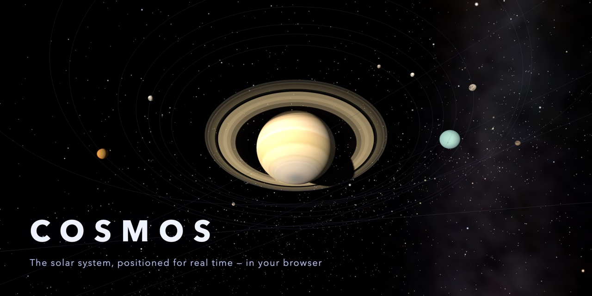

# cosmos



The solar system in Three.js, positions computed for real time.

## What is accurate

- Planet (and Pluto) positions come from Keplerian elements at J2000 with
  per-century rates; Kepler's equation is solved each frame for the simulated
  date. Good to well under a degree for the planets over ±centuries.
- Orbit shapes, eccentricities, inclinations (Pluto's 17° is visible).
- Every body's pole direction and rotation angle come from the IAU WGCCRE
  model for the sim date, so axial tilts point the right way in space (Saturn's
  rings are near edge-on around the 2025 equinox and open toward 2032),
  retrograde spins fall out of the data, and Earth's day/night terminator is
  true to within a few minutes. Giants are oblate by their measured flattening.
- All 458 moons in JPL's satellite tables are placed from their mean elements
  for the sim date, in their own reference planes (ecliptic, planet equator or
  local Laplace plane): large and notable moons as spheres, the rest as dots.
  Earth's Moon uses the leading terms of Meeus ch. 47, enough to land eclipses
  on the right day.
- Saturn's rings use measured ring and gap radii; opacity follows optical
  depth along the line of sight and brightness a thin-layer scattering model,
  with analytic shadows between rings and planet.
- The sky: 9,096 Yale Bright Star Catalogue stars at their J2000 positions,
  sized by magnitude and colored by B−V, over a Milky Way panorama rotated
  from galactic into ecliptic coordinates (registered against the catalog).
- Small bodies are solved from Keplerian elements on the GPU for the sim date:
  main belt with Kirkwood gaps (3:1, 5:2, 7:3, 2:1), Hungarias, Hildas tracing
  their triangle, Jupiter Trojans at L4/L5, Kuiper belt, plutinos, scattered
  disk.

## What is presentation

- Default view compresses distances (`AU^0.62`) and exaggerates radii so the
  system fits on a screen. The **true scale** toggle switches to linear AU and
  real radii — the humbling mode.
- The small-body population is synthetic: ~43,000 bodies drawn from the
  observed distributions of a, e, i, not a catalog. Resonant groups are locked
  to Jupiter's or Neptune's mean motion; their libration is not simulated.
- **Galactic drift** moves the Sun as it orbits the galactic center
  (230 km/s, direction ~60° out of the ecliptic) so planets trace helixes —
  sometimes ahead of the Sun, never a comet-tail wake. Pitch is shown ÷8:
  at true speed the helix is ~48 AU per Earth orbit and reads as a line.
- Surface maps are artist-processed photomosaics; brightness is scaled per
  planet for display, not photometric. Earth: NASA Blue Marble with relief,
  ocean shine, clouds and city lights on the night side; Tashkent is marked.
  Pluto's unimaged southern hemisphere is filled with neutral terrain.
- Ring optical depths are a piecewise approximation of published occultation
  profiles; the fine ringlet texture is procedural.
- In compressed mode, each moon system keeps true proportions out to three
  planet radii (rings and ring moons line up), then is squeezed
  logarithmically so it fits between planetary orbits.

## nebula/

The prequel: 7000 gas particles, three rules only
(gravity toward enclosed mass, inelastic collisions via grid-cell velocity
mixing, a small accidental net spin). Collapse, spin-up, flattening, and the
protostar's ignition all emerge — nothing is scripted. The star ends up with
~80–95% of the mass, which is the honest outcome: the real Sun took 99.86%.
Sliders for initial spin and gas stickiness; Space pauses. The camera is the
orrery's (see Controls).

## accretion/

Chapter two, inside the disk, in 3D and real units (AU, years, M☉;
G = 4π²). About 4000 planetesimals seeded on a Minimum Mass Solar Nebula
profile (Σ ∝ r^-1.5, ×4.2 in solids beyond the 2.7 AU snow line; rock inside,
ice-rich outside; 8× MMSN by default, adjustable).

- Gravity: the star and the ~40 most massive bodies act on everything, with
  equal and opposite reaction; planetesimal–planetesimal gravity is neglected,
  as in super-particle codes. Leapfrog in barycentric coordinates, dt = 1/40
  of the innermost orbit, run in a Web Worker.
- Collisions: swept closest approach against inflated radii (×100, shown in
  the HUD), analytic gravitational focusing for pairs whose mutual gravity
  isn't integrated, merging with mass and momentum conserved, and
  fragmentation above twice the escape speed.
- Gas: drag damps eccentricities and inclinations, the disk dissipates
  (τ = 3 Myr of gas age), and cores past 10 M⊕ beyond the snow line accrete
  gas at a capped Kelvin–Helmholtz rate. Gas processes run on their own clock,
  1000 gas years per orbital year, to keep pace with the inflated-radius
  growth; drag and gas accretion are parametrised models.
- The HUD shows orbital time, gas age, and energy, momentum and angular
  momentum errors after subtracting the known changes from drag, collisions,
  gas and removals.

## Run

```sh
npm install
npm run dev      # orrery at /, plus /nebula/ and /accretion/
```

## Build

```sh
npm run build        # single files, open from disk
npm run build:web    # multi-file site for hosting
```

`npm run build` writes `dist/index.html`, `dist/nebula/index.html` and
`dist/accretion/index.html`. Each is one self-contained file (scripts and
textures inlined) that opens straight from disk, with no server or network.

`npm run build:web` writes `dist/web/` with assets as separate files and
relative paths, so it can be served from any directory. Set `SITE_URL` (see
`.env.example`) to the public URL before building so link previews get an
absolute `og:image`; without it the preview tags carry only title and
description.

The container image serves `dist/web/` with nginx on port 8080 (`/health`
for probes):

```sh
SITE_URL=https://example.org/ TAG=v0.1.0 docker buildx bake --push
```

`npm run check` type-checks; `npm test` runs the physics tests, which compare
positions against JPL Horizons.

## Controls

| Input | Action |
|---|---|
| Drag | look around (free) · orbit target (orbit) |
| Right-drag | pan |
| Scroll | zoom in / out |
| - / = | throttle down / up |
| W / S · A / D · R / F | forward / back · strafe · up / down |
| Q / E | roll |
| Shift | boost |
| Tab | switch free / orbit camera |
| Click a body or label | fly to it |
| Esc · double-click empty space | release the target |
| H | return to the overview |
| C | constellations |
| Space · [ / ] | pause / resume · slower / faster time |
| 1 / 2 / 3 | open the nebula, accretion or solar-system page |
| ? | controls help |

## URL parameters

- `?perf` shows frame rate, CPU and GPU time per frame, draw calls and GPU
  memory counts.
- `?dpr=<n>` sets the render pixel ratio (default: the display's, capped at
  1.5).

## Credits

- Milky Way panorama: ESO/S. Brunier, CC BY 4.0
  (https://www.eso.org/public/images/eso0932a/); resized and recompressed to
  WebP, point sources filtered out at load.
- Stars: Yale Bright Star Catalogue, 5th revised ed. (Hoffleit & Warren), via
  CDS (VizieR V/50).
- Constellation figures and names: d3-celestial by Olaf Frohn, BSD-3-Clause
  (https://github.com/ofrohn/d3-celestial; license in `licenses/`). `scripts/build-constellations.js`
  regenerates `src/assets/sky/constellations.json` from its
  `constellations.lines.json` and `constellations.json`.
- Planet, Sun and Moon maps: Solar System Scope (solarsystemscope.com),
  CC BY 4.0; resized and recompressed to WebP.
- Earth: NASA Visible Earth Blue Marble; relief, specular and cloud maps from
  the three.js examples (MIT).
- Pluto: NASA/JHUAPL/SwRI New Horizons global mosaic via USGS Astrogeology
  (public domain).
- Satellite elements and sizes: NASA/JPL-Caltech Solar System Dynamics.
- Rotation models: IAU Working Group on Cartographic Coordinates and
  Rotational Elements (Archinal et al. 2018).

## License

Code is MIT (see `LICENSE`). Images and data under Credits keep their own
licenses; CC BY 4.0 material requires the attribution above when redistributed.
